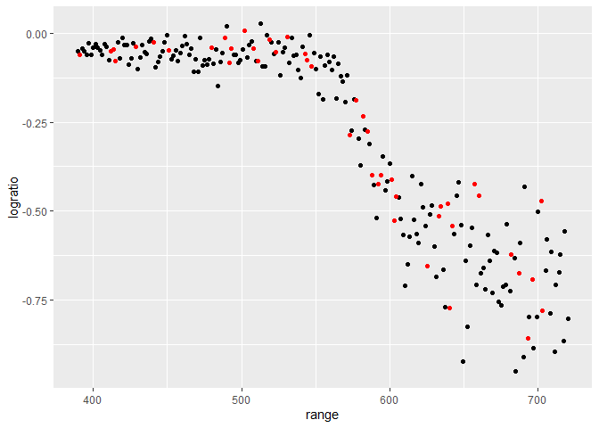
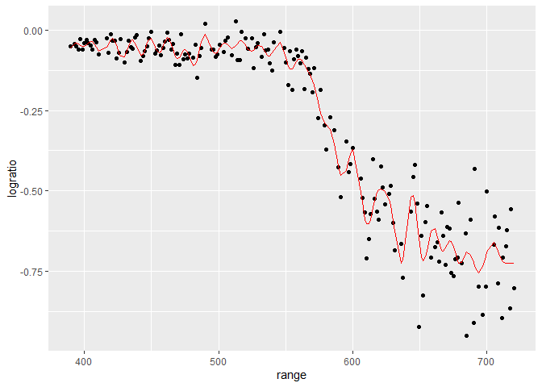
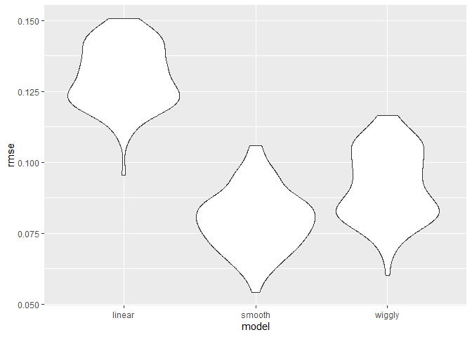

Cross validation
================

``` r
library(tidyverse)
```

    ## Warning: package 'tidyverse' was built under R version 4.5.2

    ## ── Attaching core tidyverse packages ──────────────────────── tidyverse 2.0.0 ──
    ## ✔ dplyr     1.1.4     ✔ readr     2.1.5
    ## ✔ forcats   1.0.0     ✔ stringr   1.5.1
    ## ✔ ggplot2   3.5.2     ✔ tibble    3.2.1
    ## ✔ lubridate 1.9.4     ✔ tidyr     1.3.1
    ## ✔ purrr     1.1.0     
    ## ── Conflicts ────────────────────────────────────────── tidyverse_conflicts() ──
    ## ✖ dplyr::filter() masks stats::filter()
    ## ✖ dplyr::lag()    masks stats::lag()
    ## ℹ Use the conflicted package (<http://conflicted.r-lib.org/>) to force all conflicts to become errors

``` r
library(p8105.datasets)
library(modelr)
```

``` r
data("lidar")
```

``` r
lidar_df = 
  lidar |> 
  mutate(id = row_number())

lidar_df |> 
  ggplot(aes(x = range, y = logratio)) + 
  geom_point()
```

<!-- -->

``` r
# see graph is non linear, and non constant variance.
```

## Create dataframes

Creating training and test dataset

``` r
train_df = 
  sample_frac(lidar_df, size = .8) |> 
  arrange(id)

test_df = anti_join(lidar_df, train_df, by = "id")
  # rows in lidar that did not show up in testing dataframe
```

Look at training and test dataframe

``` r
ggplot(train_df, aes(x = range, y = logratio)) + 
  geom_point() + 
  geom_point(data = test_df, color = "red")
```

<!-- -->

Fit a few diff models to train_df

``` r
linear_mod = lm(logratio ~ range, data = train_df)
smooth_mod = mgcv::gam(logratio ~ s(range), data = train_df)
wiggly_mod = mgcv::gam(logratio ~ s(range, k = 50), sp = 10e-8, data = train_df)

# mgcv - non linear model
# gam - gitting non linear model
```

``` r
train_df |> 
  add_predictions(wiggly_mod) |> 
  ggplot(aes(x = range, y = logratio)) + 
  geom_point() + 
  geom_line(aes(y = pred), color = "red")
```

<!-- -->

``` r
# linear mod is not a good model
```

Calculate rmse

``` r
rmse(linear_mod, test_df)
```

    ## [1] 0.1262218

``` r
rmse(smooth_mod, test_df)
```

    ## [1] 0.08264608

``` r
rmse(wiggly_mod, test_df)
```

    ## [1] 0.09109566

``` r
# smooth better than linear, wiggly doing too much
```

## Iterate!

``` r
cv_df = 
  crossv_mc(lidar_df, n = 100) |> 
  mutate(
    train = map(train, as_tibble),
    test = map(test, as_tibble)
  )

# iterate and save as table using as_tibble
```

check this worked

``` r
cv_df |> pull(train) |> nth(1)
```

    ## # A tibble: 176 × 3
    ##    range logratio    id
    ##    <dbl>    <dbl> <int>
    ##  1   390  -0.0504     1
    ##  2   391  -0.0601     2
    ##  3   393  -0.0419     3
    ##  4   394  -0.0510     4
    ##  5   399  -0.0596     7
    ##  6   400  -0.0399     8
    ##  7   402  -0.0294     9
    ##  8   403  -0.0395    10
    ##  9   405  -0.0476    11
    ## 10   406  -0.0604    12
    ## # ℹ 166 more rows

``` r
# see that we have diff datasets using iterations
```

Fit model for each of the dataset

``` r
lidar_lm = function(df) {
  
  lm(logratio ~ range, data = df)
  
}
```

``` r
cv_df =
  cv_df |> 
  mutate(
    linear_fits = map(train, \(df) lm(logratio ~ range, data = df)),
    smooth_fits = map(train, \(df) mgcv::gam(logratio ~ s(range), data = df)),
    wiggly_fits = map(train, \(df) mgcv::gam(logratio ~ s(range, k = 50), sp = 10e-8, data = df))
  ) |> 
  mutate(
    rmse_linear = map2_dbl(linear_fits, test, rmse),
    rmse_smooth = map2_dbl(smooth_fits, test, rmse),
    rmse_wiggly = map2_dbl(wiggly_fits, test, rmse)
  )

# /df is annonymous function, embed function to the right in map
# second chunk is mapping rmse for each testing dataset for each linear model fit. map 2 because mapping across 2 columns. map2_dbl bc just want to pull out the value
```

let’s look at what the baove produced

``` r
cv_df |> 
  select(starts_with("rmse")) |> 
  pivot_longer(
    everything(),
    names_to = "model",
    values_to = "rmse",
    names_prefix = "rmse_"
  ) |> 
  ggplot(aes(x = model, y = rmse)) + 
  geom_violin()
```

<!-- -->

``` r
# see linear model is worst, best is smooth
```
