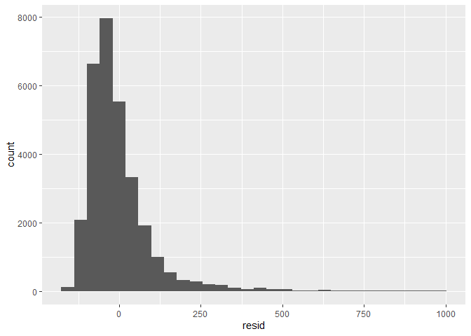
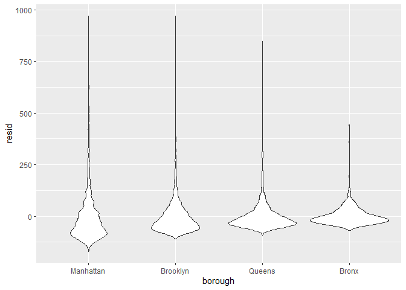
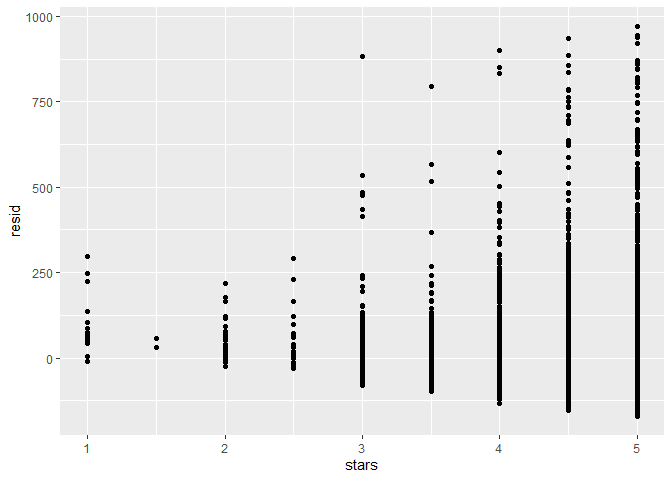
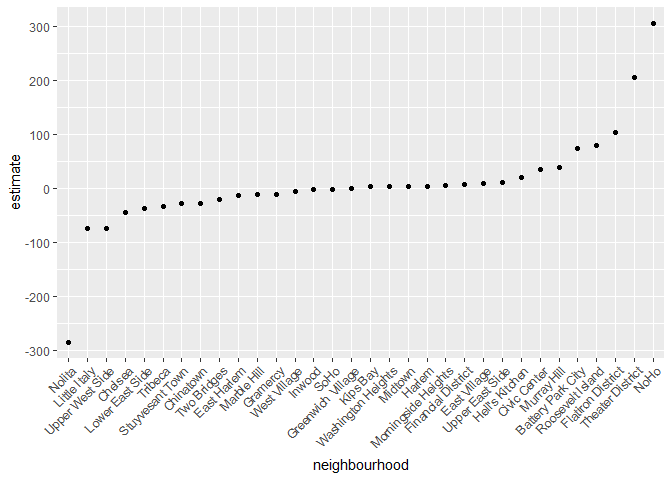

linear_models
================

``` r
library(tidyverse)
```

    ## ── Attaching core tidyverse packages ──────────────────────── tidyverse 2.0.0 ──
    ## ✔ dplyr     1.1.4     ✔ readr     2.1.5
    ## ✔ forcats   1.0.0     ✔ stringr   1.5.1
    ## ✔ ggplot2   3.5.2     ✔ tibble    3.2.1
    ## ✔ lubridate 1.9.4     ✔ tidyr     1.3.1
    ## ✔ purrr     1.1.0     
    ## ── Conflicts ────────────────────────────────────────── tidyverse_conflicts() ──
    ## ✖ dplyr::filter() masks stats::filter()
    ## ✖ dplyr::lag()    masks stats::lag()
    ## ℹ Use the conflicted package (<http://conflicted.r-lib.org/>) to force all conflicts to become errors

``` r
library(p8105.datasets)

set.seed(1)
```

``` r
data(nyc_airbnb)
```

Look at data / do some cleaning.

``` r
nyc_airbnb = 
  nyc_airbnb |> 
  mutate(
    stars = review_scores_location / 2
  ) |> 
  rename(
    borough = neighbourhood_group
  ) |> 
  filter(borough != "Staten Island") |> 
  select(price, stars, borough, room_type, neighbourhood)
```

fit regression

borough is character variable. R converts to factor, then runs
regression. It creates dummy variables for you by alphabetical order
based on factor order. In this case brooklyn is the reference?

``` r
fit = lm(price ~ stars + borough, data = nyc_airbnb)
```

additional cleaning then refit

fct_infreq - put categories in order of what frequency they appear in
dataset. the biggest category is first. Make reference group your
biggest category for borough

``` r
nyc_airbnb= 
  nyc_airbnb |> 
  mutate(
    borough = fct_infreq(borough),
    room_type = fct_infreq(room_type)
  )

fit = lm(price ~ stars + borough, data = nyc_airbnb)
```

look at lm stuff

see

``` r
summary(fit)
names(summary(fit))
summary(fit)[["coefficients"]]
summary(fit)[["df"]]

fitted.values(fit)
residu(fit)
```

look at cleaner `lm` stuff

``` r
fit |> 
  broom::tidy() |> 
  mutate(
    term = str_replace(term, "borough", "Borough: ")
  ) |> 
  select(term, estimate, p.value) |> 
  knitr::kable(digits = 3)
```

| term              | estimate | p.value |
|:------------------|---------:|--------:|
| (Intercept)       |   19.839 |   0.104 |
| stars             |   31.990 |   0.000 |
| Borough: Brooklyn |  -49.754 |   0.000 |
| Borough: Queens   |  -77.048 |   0.000 |
| Borough: Bronx    |  -90.254 |   0.000 |

``` r
fit |> 
  broom::glance()
```

    ## # A tibble: 1 × 12
    ##   r.squared adj.r.squared sigma statistic   p.value    df   logLik    AIC    BIC
    ##       <dbl>         <dbl> <dbl>     <dbl>     <dbl> <dbl>    <dbl>  <dbl>  <dbl>
    ## 1    0.0342        0.0341  182.      271. 6.73e-229     4 -202113. 4.04e5 4.04e5
    ## # ℹ 3 more variables: deviance <dbl>, df.residual <int>, nobs <int>

## Diagnostics

look at residuals.

Any time you fit a model have to do this

``` r
nyc_airbnb |> 
  modelr::add_residuals(fit) |> # adds residuals to table
  modelr::add_predictions(fit) |> 
  filter(resid < 1000) |> 
  ggplot(aes(x =resid)) +
  geom_histogram()
```

    ## `stat_bin()` using `bins = 30`. Pick better value with `binwidth`.

<!-- -->

``` r
nyc_airbnb |> 
  modelr::add_residuals(fit) |> # adds residuals to table
  modelr::add_predictions(fit) |> 
  filter(resid < 1000) |> 
  ggplot(aes(x = borough, y = resid)) +
  geom_violin()
```

<!-- -->

``` r
nyc_airbnb |> 
  modelr::add_residuals(fit) |> # adds residuals to table
  modelr::add_predictions(fit) |> 
  filter(resid < 1000) |> 
  ggplot(aes(x = stars, y = resid)) +
  geom_point()
```

<!-- -->

## Hypothesis testing

this is for individual predictors

``` r
fit |> 
  broom::tidy()
```

    ## # A tibble: 5 × 5
    ##   term            estimate std.error statistic   p.value
    ##   <chr>              <dbl>     <dbl>     <dbl>     <dbl>
    ## 1 (Intercept)         19.8     12.2       1.63 1.04e-  1
    ## 2 stars               32.0      2.53     12.7  1.27e- 36
    ## 3 boroughBrooklyn    -49.8      2.23    -22.3  6.32e-109
    ## 4 boroughQueens      -77.0      3.73    -20.7  2.58e- 94
    ## 5 boroughBronx       -90.3      8.57    -10.5  6.64e- 26

but what about categorical predictor

``` r
fit_alt = lm(price ~ stars + borough + room_type, data = nyc_airbnb)
fit_null = lm(price ~ stars + borough , data = nyc_airbnb)

anova(fit_null, fit_alt) |> 
  broom::tidy()
```

    ## # A tibble: 2 × 7
    ##   term                        df.residual    rss    df   sumsq statistic p.value
    ##   <chr>                             <dbl>  <dbl> <dbl>   <dbl>     <dbl>   <dbl>
    ## 1 price ~ stars + borough           30525 1.01e9    NA NA            NA       NA
    ## 2 price ~ stars + borough + …       30523 9.21e8     2  8.42e7     1394.       0

## Interactions vs nested data

``` r
fit_interactions = 
  lm(price ~ stars + room_type * borough, data = nyc_airbnb)

fit_interactions |> 
  broom::tidy()
```

    ## # A tibble: 13 × 5
    ##    term                                  estimate std.error statistic  p.value
    ##    <chr>                                    <dbl>     <dbl>     <dbl>    <dbl>
    ##  1 (Intercept)                              121.      11.8      10.3  1.01e-24
    ##  2 stars                                     21.8      2.42      8.97 3.06e-19
    ##  3 room_typePrivate room                   -125.       2.99    -41.7  0       
    ##  4 room_typeShared room                    -154.       8.69    -17.7  9.81e-70
    ##  5 boroughBrooklyn                          -55.5      2.94    -18.9  2.81e-79
    ##  6 boroughQueens                            -86.7      5.66    -15.3  1.09e-52
    ##  7 boroughBronx                            -108.      14.9      -7.27 3.78e-13
    ##  8 room_typePrivate room:boroughBrooklyn     32.4      4.31      7.51 5.97e-14
    ##  9 room_typeShared room:boroughBrooklyn      48.1     13.9       3.46 5.34e- 4
    ## 10 room_typePrivate room:boroughQueens       56.0      7.44      7.52 5.60e-14
    ## 11 room_typeShared room:boroughQueens        60.7     17.9       3.40 6.72e- 4
    ## 12 room_typePrivate room:boroughBronx        71.6     18.0       3.98 7.03e- 5
    ## 13 room_typeShared room:boroughBronx         85.4     42.4       2.01 4.41e- 2

the effect of start in brooklyn is 27.1-6.14

Lets just look at brooklyn first

``` r
nyc_airbnb |> 
  filter(borough == "Brooklyn") |> 
  lm(price ~ stars + room_type, data = _) |> 
  broom::tidy()
```

    ## # A tibble: 4 × 5
    ##   term                  estimate std.error statistic   p.value
    ##   <chr>                    <dbl>     <dbl>     <dbl>     <dbl>
    ## 1 (Intercept)               69.6     14.0       4.96 7.27e-  7
    ## 2 stars                     21.0      2.98      7.05 1.90e- 12
    ## 3 room_typePrivate room    -92.2      2.72    -34.0  6.40e-242
    ## 4 room_typeShared room    -106.       9.43    -11.2  4.15e- 29

``` r
nyc_airbnb |> 
  filter(borough == "Manhattan") |> 
  lm(price ~ stars + room_type, data = _) |> 
  broom::tidy()
```

    ## # A tibble: 4 × 5
    ##   term                  estimate std.error statistic   p.value
    ##   <chr>                    <dbl>     <dbl>     <dbl>     <dbl>
    ## 1 (Intercept)               95.7     22.2       4.31 1.62e-  5
    ## 2 stars                     27.1      4.59      5.91 3.45e-  9
    ## 3 room_typePrivate room   -124.       3.46    -35.8  9.40e-270
    ## 4 room_typeShared room    -154.      10.1     -15.3  2.47e- 52

``` r
nyc_airbnb |> 
  filter(borough == "Bronx") |> 
  lm(price ~ stars + room_type, data = _) |> 
  broom::tidy()
```

    ## # A tibble: 4 × 5
    ##   term                  estimate std.error statistic  p.value
    ##   <chr>                    <dbl>     <dbl>     <dbl>    <dbl>
    ## 1 (Intercept)              90.1      15.2       5.94 5.73e- 9
    ## 2 stars                     4.45      3.35      1.33 1.85e- 1
    ## 3 room_typePrivate room   -52.9       3.57    -14.8  6.21e-41
    ## 4 room_typeShared room    -70.5       8.36     -8.44 4.16e-16

``` r
nyc_airbnb |> 
  filter(borough == "Queens") |> 
  lm(price ~ stars + room_type, data = _) |> 
  broom::tidy()
```

    ## # A tibble: 4 × 5
    ##   term                  estimate std.error statistic  p.value
    ##   <chr>                    <dbl>     <dbl>     <dbl>    <dbl>
    ## 1 (Intercept)              91.6      25.8       3.54 4.00e- 4
    ## 2 stars                     9.65      5.45      1.77 7.65e- 2
    ## 3 room_typePrivate room   -69.3       4.92    -14.1  1.48e-43
    ## 4 room_typeShared room    -95.0      11.3      -8.43 5.52e-17

start here for homework problem write a short function to do the above

``` r
lm_airbnb = function(df) {
  
  lm(price ~ stars + room_type, data = df)
}

nyc_airbnb |> 
  filter(borough == "Queens") |> 
  lm_airbnb() |> 
  broom::tidy()
```

    ## # A tibble: 4 × 5
    ##   term                  estimate std.error statistic  p.value
    ##   <chr>                    <dbl>     <dbl>     <dbl>    <dbl>
    ## 1 (Intercept)              91.6      25.8       3.54 4.00e- 4
    ## 2 stars                     9.65      5.45      1.77 7.65e- 2
    ## 3 room_typePrivate room   -69.3       4.92    -14.1  1.48e-43
    ## 4 room_typeShared room    -95.0      11.3      -8.43 5.52e-17

Create a list of dataframes, and iterate to fit the model each time

``` r
nested_lm_results = 
  nyc_airbnb |> 
  nest(data = -borough) |> 
  mutate(
    fits = map(data, lm_airbnb),
    results = map(fits, broom::tidy)
  ) |> 
  select(borough, results) |> 
  unnest(results)
```

do some untidying

below, we don’t get p values but see the difference between boroughs for
exploratory analysis

``` r
nested_lm_results |> 
  select(borough, term, estimate) |> 
  pivot_wider(
    names_from = term, 
    values_from = estimate
  )
```

    ## # A tibble: 4 × 5
    ##   borough   `(Intercept)` stars `room_typePrivate room` `room_typeShared room`
    ##   <fct>             <dbl> <dbl>                   <dbl>                  <dbl>
    ## 1 Bronx              90.1  4.45                   -52.9                  -70.5
    ## 2 Queens             91.6  9.65                   -69.3                  -95.0
    ## 3 Brooklyn           69.6 21.0                    -92.2                 -106. 
    ## 4 Manhattan          95.7 27.1                   -124.                  -154.

use an *anonymous* function instead of `lm_airbnb`

the backslash thing is to allow you to not need to have the function on
the side

``` r
nested_lm_results = 
  nyc_airbnb |> 
  nest(data = -borough) |> 
  mutate(
    fits = map(data, \(df) lm(price ~ stars + room_type, data = df)), 
    results = map(fits, broom::tidy)
  ) |> 
  select(borough, results) |> 
  unnest(results)
```

let’s do an even more extreme example

effect of stars in different neighborhoods

``` r
manhattan_analysis = 
  nyc_airbnb |> 
  filter(
    borough == "Manhattan"
  ) |> 
  nest(data = -neighbourhood) |> 
  mutate(
    fits = map(data, \(df) lm(price ~ stars + room_type, data = df)),
    results = map(fits, broom::tidy)
  ) |> 
  select(neighbourhood, results) |> 
  unnest(results)
```

Make a plot

effect of increasing start values across neihgborhoods in manhattan

``` r
manhattan_analysis |> 
  filter(term == "stars") |> 
  mutate(
    neighbourhood = fct_reorder(neighbourhood, estimate)
  ) |> 
  ggplot(aes(x = neighbourhood, y = estimate)) +
  geom_point() +
  theme(axis.text.x = element_text(angle = 45, hjust = 1))
```

<!-- -->
